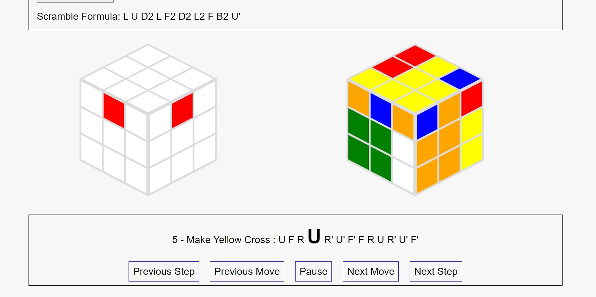

# TicTacToe Game for Tuq Interview Process

The code can be check under the files 'tictactoe.html', 'tictactoeCSS.css', and 'tictactoeJS.js'.
JavaScript was mainly used for this game.

I decided to add the game on my website so it could be used without the need for me to host another website.

# Rubiks-Cube-Solver-Project

This is a website that can solve a Rubik's Cube. It was written with mainly JavaScript. 

I plan to build a robot to solve a Rubik's Cube on its own. This website project was a step toward this goal. 

You can either input your scramble formula or generate from the website. 

The website outputs each step for the solution. It also contains two visual cubes; one for movement and one for the step you are in. 

The webiste is hosted and can be accesseed here https://rubikscubesolverproject.000webhostapp.com/.

